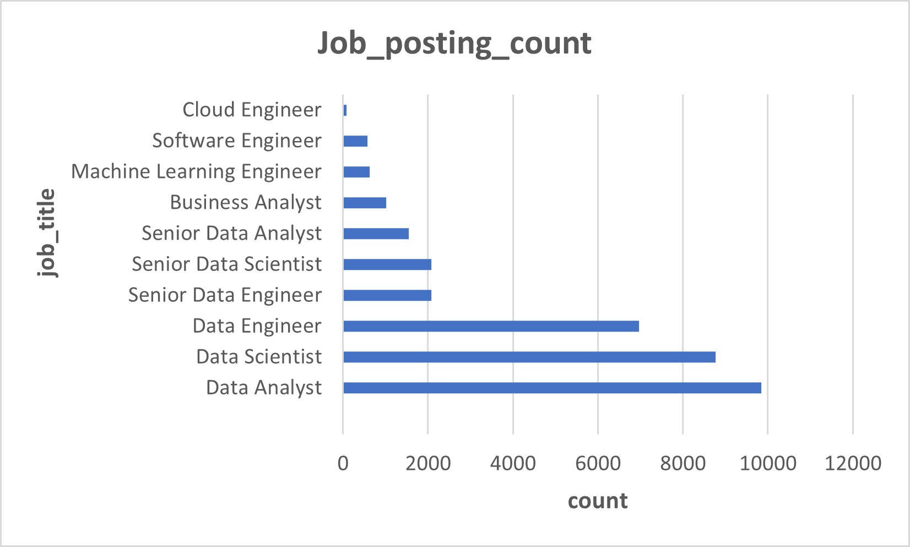
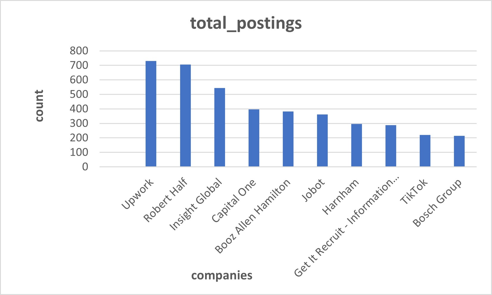
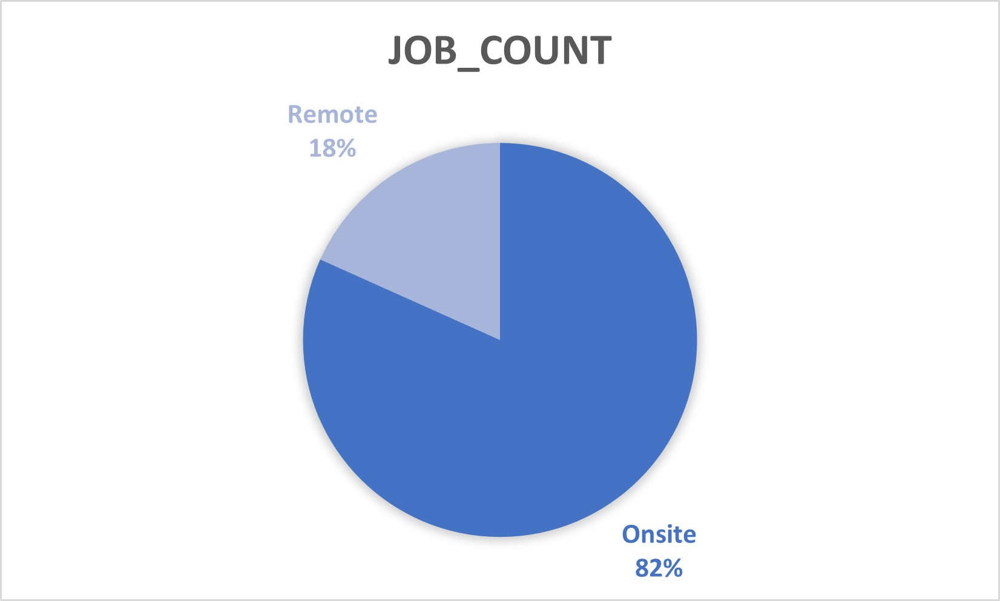
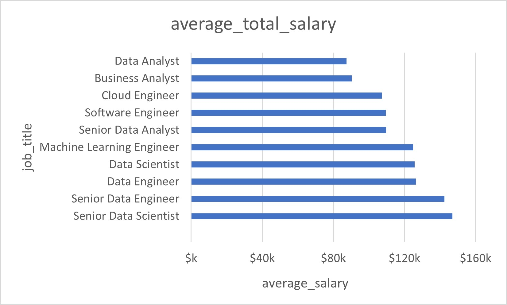
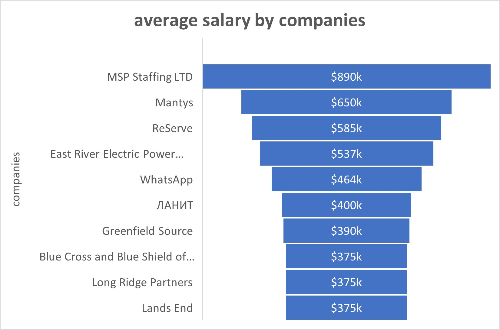
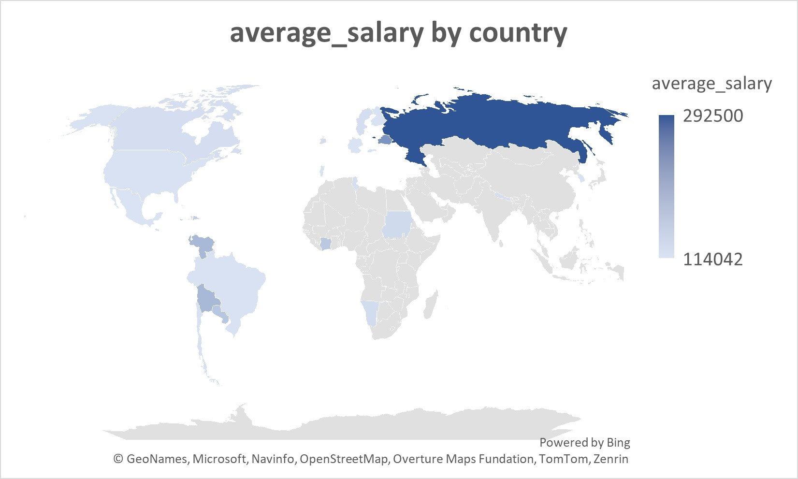
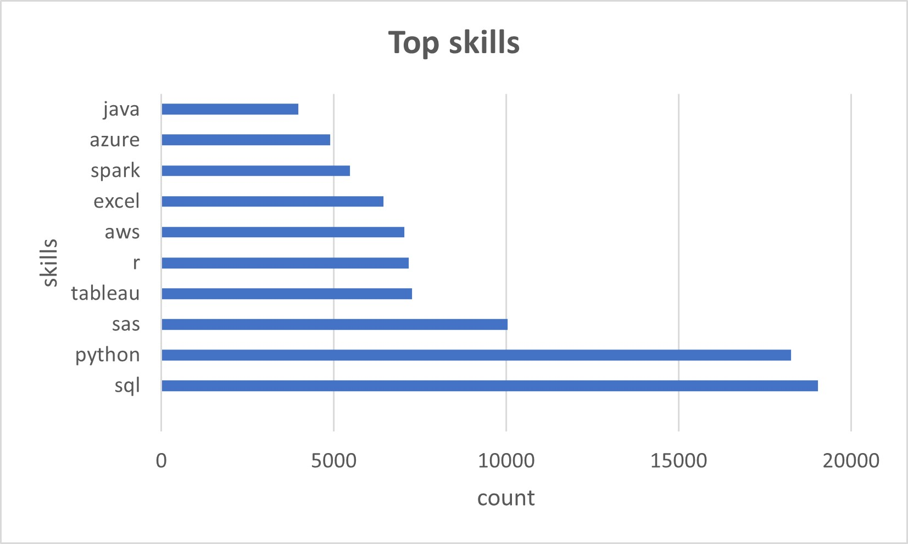
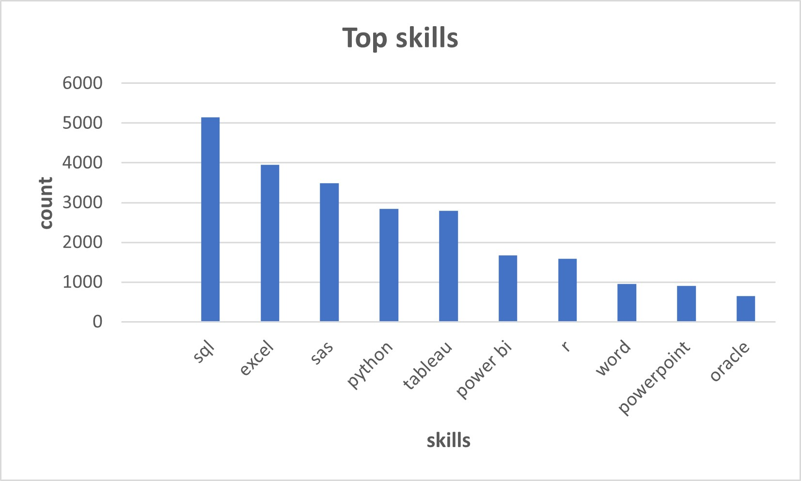

# 💼 Data Jobs Market Insights Using SQL Queries

## 📌 Project Description

Analyze job market trends using SQL on a dataset of 2023 data job postings. This project focuses on uncovering insights about data job titles, salaries, remote work, hiring companies, and in-demand data skills.

---

## 🗃️ Dataset

* **Source**:`jobs_2023.sqlite`
* **Format Used**: Converted to MySQL `.sql`
* **Tables**:

  * `job_postings_fact`
  * `company_dim`
  * `skills_dim`
  * `skills_job_dim`

---

## 🌟 Objectives

1. Find most common job titles
2. Identify companies with the most job postings
3. Count remote vs onsite jobs
4. Calculate average salary by job title
5. List companies offering the highest average salaries
6. Compare average salary by country
7. Find most in-demand skills overall
8. Analyze top skills required for Data Analyst roles

---

## 🛠️ Tools Used

* SQL (MySQL)
* VS Code with MySQL Extension
* Excel (for exporting results)
* Git & GitHub

---

## 📊 Key SQL Queries & Insights

Detailed SQL queries were written for each objective to uncover insights such as top job titles, salary patterns, remote work distribution, and skill requirements. These queries were executed in MySQL and results were exported to visualize and interpret the data effectively.

---

## 📸 Screenshots

> All charts below were created in **Microsoft Excel** using the data exported from SQL queries. Each chart visualizes one of the project’s main objectives.

### 🌟 Objective 1: Most Common Job Titles

### 🌟 Objective 2: Top Companies by Job Postings

### 🌟 Objective 3: Remote vs Onsite Job Count

### 🌟 Objective 4: Average Salary by Job Title

### 🌟 Objective 5: Top Companies by Average Yearly Salary

### 🌟 Objective 6: Average Salary by Country

### 🌟 Objective 7: Most In-Demand Skills Overall

### 🌟 Objective 8: Top Skills Required for Data Analyst Jobs

---

